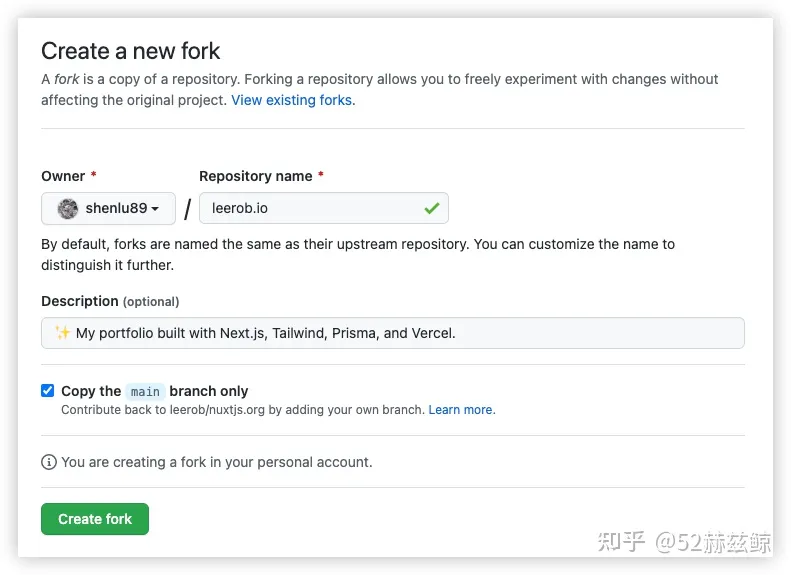
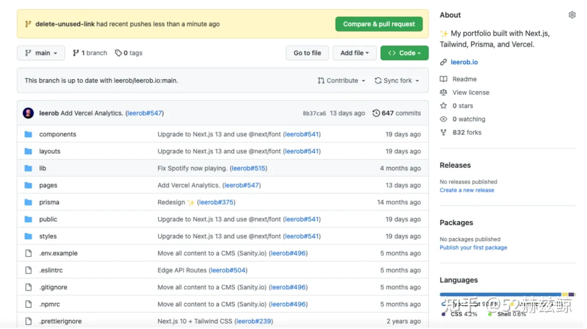
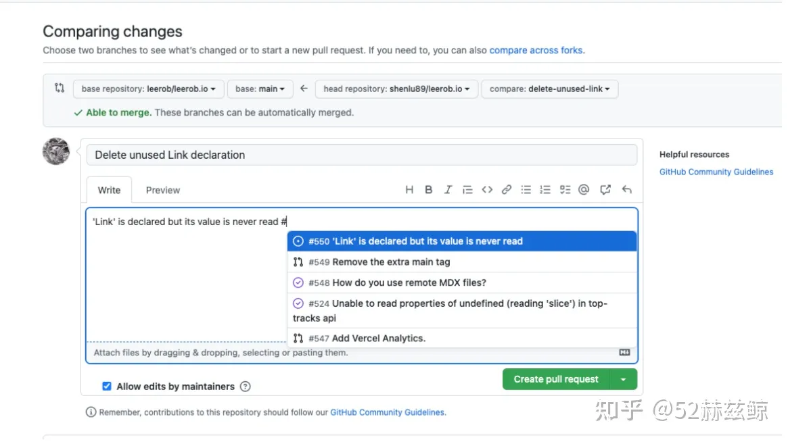
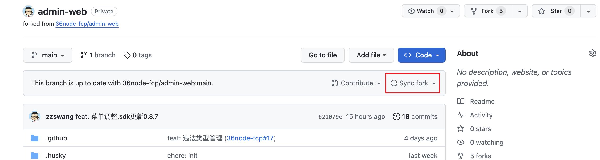
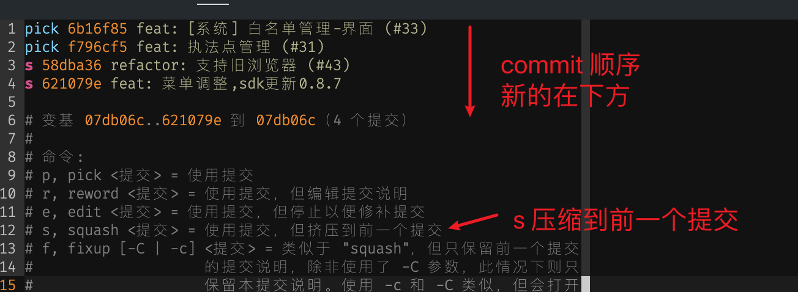

# 采用 Fork & PR 的方式工作

当我们领取了任务后，如何开展工作呢？

冒险者公会鼓励采用 Fork & PR 代码协作模型。


## Fork 一个仓库

进入某个仓库的主页，点击`Fork`按钮，创建一个新的派生项目(Create a new fork)



进入自己的仓库，将会看到一个`fork`的仓库

如果安装了github的命令行工具，可以使用如下命令快速完成

```sh
gh fork 36node-fcp/admin-web
```

如果你喜欢使用 `github desktop` 工具，可以[参考 Github Docs 上的帮助文档](https://docs.github.com/en/desktop/adding-and-cloning-repositories/cloning-and-forking-repositories-from-github-desktop#forking-a-repository)，它可以很方便的帮助你 fork 一个仓库。

## 创建分支进行工作

现在仓库都在您自己的空间下，如何clone代码想必已经是驾轻就熟了。

```sh
git clone https://github.com/YOUR-USERNAME/Spoon-Knife
```

但是不要着急直接在 main 分支上开展工作，这不是一个好习惯。

根据这次任务的需要，创建一个需要的分支

```sh
## feature
git checkout -b feat/some-feature

## fix bug
git checkout -b fix/some-bug

## refactor
git checkout -b refactor/route

## docs
git checkout -b docs/some-doc

## devops
git checkout -b chore/github-ci
```

如果是 hotfix，则需要从 tag 迁出分支，总之我们将不再`main`分支上直接工作，这个可以确保我们可以有条不紊的并行好几项工作，并且在与remote同步时，保持简洁，不易出错。

代码或者文档更新完成后，`commit` 你的修改并推送到你自己的仓库中。

```
git add some-file
git commit -m "feat: finish some work"
git push -u origin feat/some-feature
```

## 创建 PR

最直观的方法是在网页上创建 PR，回到派生的`repo`，会看到新分支和修改的合并提交信息，点击 `Compare & pull request`



仔细填写 PR 的标题和内容，每个工程往往会有自己的格式要求。

如果有对应的`issue`，可以通过键入`#`添加(Github 会自动展示 issues 列表)。

在`#`前面添加`close`关键字，会在`PR`合并后自动关闭这个 issue。



我们也可以通过`gh`命令来实现这一步

```
gh create pr
```

## 合并上游修改

请时刻记住，`origin repo`(我们可以称之为upstream)会不断更新前进，我们在每次开展新工作之前，尽量都要与`upstream`保持同步。同步也很简单，因为我们保持了`main`分支的纯洁，不会产生不良后果。



点击`Sync fork`按钮进行同步，可以只选择同步`main`分支。

现在回到我们的电脑上，使用如下命令将 main 分支上的代码同步到我们的工作空间。

```sh
cd ./your-code-folder
git pull
```

我们有几种情况需要使用`rebase`来推进我们当前正在工作的分支：

- 我们需要`main`分支上的一些代码
- 提交的`pr`与upstream有冲突(conflict)
- 自律

不要害怕`rebase`，这是git最核心最有价值的一部分。

```sh
# 回到你工作的分支
git checkout feat/some-feat

# rebase main
git rebase main
```

在 rebase 过程中，根据提示一步接一步的操作，有冲突的文件可以在 vscode 编辑器里调整。需注意:

- rebase 过程中，只需要使用`git add`而不需要`git commit`
- 解决完冲突后，需要执行 git rebase --continue
- git rebase --abort 可以帮助你撤销并退出本次操作

### 进阶操作

rebase 的原理是将你本地的commit，挨个调整。如果你的分支有很多稀碎的commit，rebase --continue 会需要执行多次。此时可以考虑压缩一下这些commit，将会减少 rebase 的次数。

压缩(squash)也是使用 rebase 命令。

```sh
# 查看自己分支上的提交记录，并复制希望压缩到的 commit sha
git log
# 从 head 一直到你选中的 sha 将会被压缩成一条 commit 记录
git rebase -i sha
# 此时会打开一个 vim 
# 需要压缩的条目，前缀改成 s 或者 f
# 修改完成后，esc，:wq 保存退出
# 如果想撤销这次 squash，esc, :q! 退出
```

具体可以参考下图



## 为什么我们不推荐 Branch & PR 模型

`Branch & PR` 模型是指当你有`repo`的写权限时，直接在原有仓库创建分支进行工作并提交代码。

1. 不安全

需要为协作者开放`repo`的写权限，才能推送分支。

最具有威胁的操作是 push origin :main，将清空服务器仓库里的主分支。

2. 会产生很多垃圾分支

需要优秀的分支命名和以及及时的清除政策，否则github仓库里将会充斥各种奇怪的分支，甚至会重名，例如很多人喜欢把一个分支叫`fix/some`。

本地工作环境由于经常从`origin`拉取代码，也会将这些分支都拉到本地，过一段时间就需要用`prune`命令进行清除，繁琐且容易出错。

3. 容易被误删除

类似`github desktop`工具，是可以方便的将远端分支删除，我曾经就错误的指导过同事，一下子把线上基于`branch`的`PR`都删掉了。

4. 采用`fork`的方式，在自己的空间下，可以一目了然的了解自己工作的`repo list`。

## 参考

- [github 官方文档](https://docs.github.com/en/get-started/quickstart/fork-a-repo)
- [如何在 Github 提交第一个 pull request](https://www.freecodecamp.org/chinese/news/how-to-make-your-first-pull-request-on-github)
- [如何在 Github 上规范的提交 PR（图文详解）](https://zhuanlan.zhihu.com/p/584834288)

TODO:

1. 哪位小伙伴研究一下，并提交一份文档。如何完全用`Github Desktop`工具完成`fork and pr`的工作，这将对产品经理有很大的帮助。根据 Desktop 的官方文档说明，这是一个比较方便的操作。
